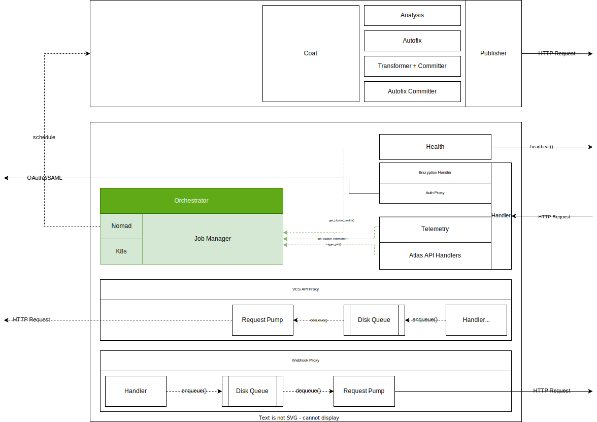
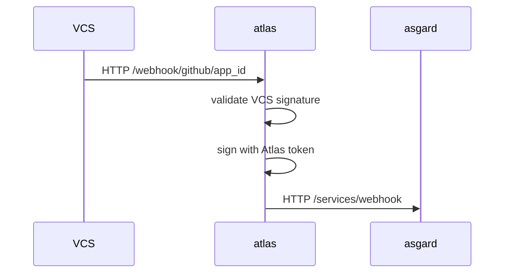
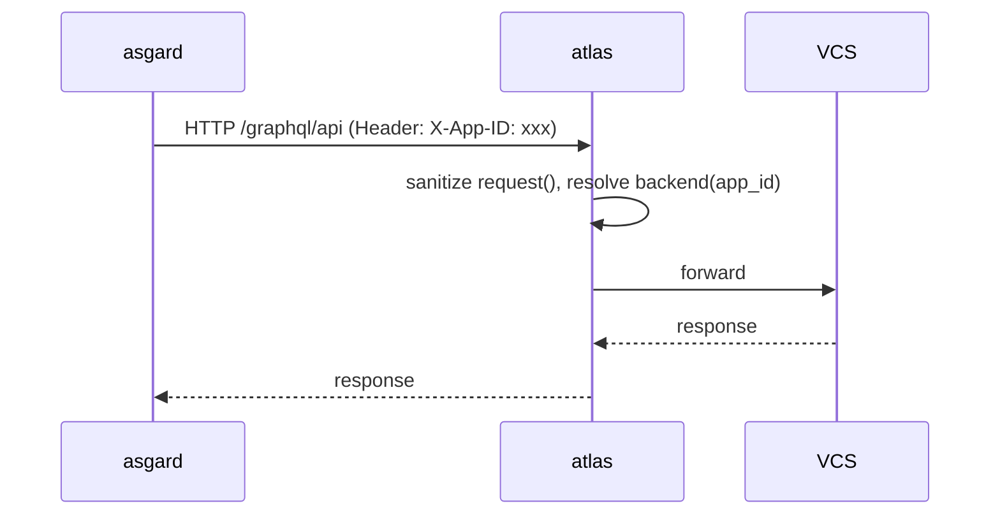
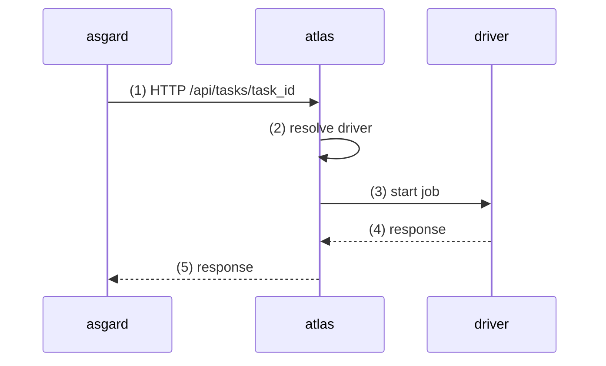
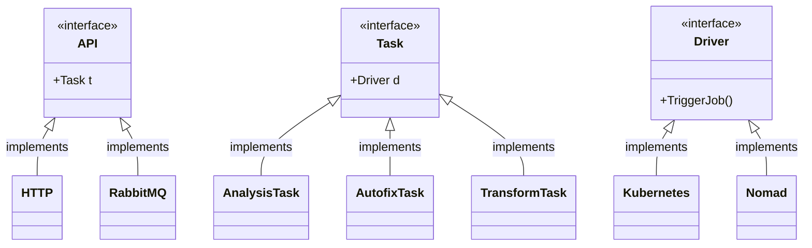
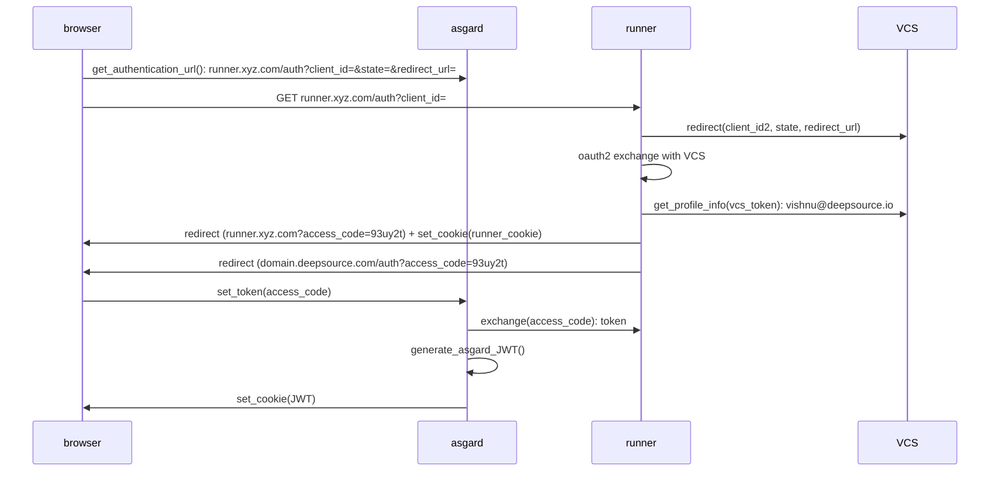
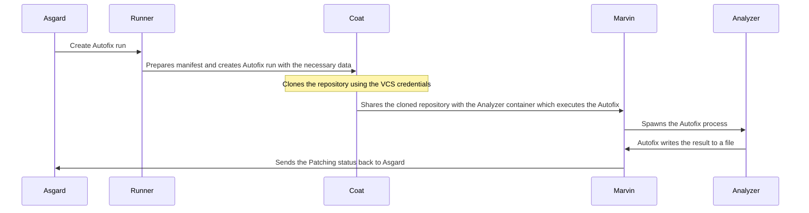
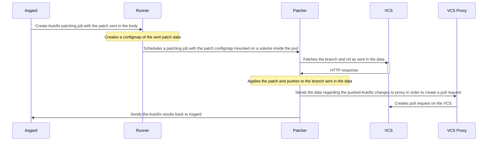
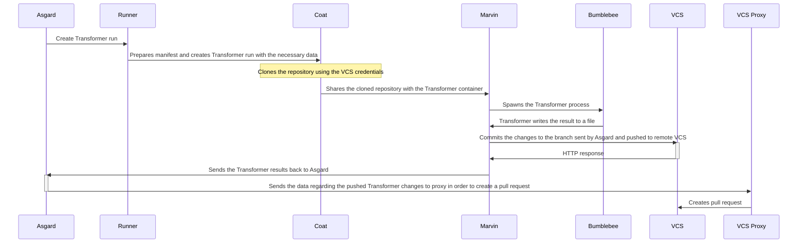

# Atlas v2.0.0 (DeepSource Enterprise Runner)

Atlas v2.0.0 is an application that would be deployed on-premise at our customer's end. There are a few primary technical requirements for this service:

- Source code and other sensitive information must never leave the customer's own infrastructure.
- Enable a simpler alternative to a full-scale DeepSource Enterprise installation.

## High level architecture

The following is a high-level architecture diagram outlining the Runner and its primary modules.

## Modules

---

### Webhook Proxy

This layer relays the webhooks that are received from VCS providers to cloud. Webhooks frokm the VCS providers are signed with a secret. However, to ensure that no user secrets are made available to our cloud services, the webhooks signatures are verified and signed again using a secret that is shared between the runner and cloud. This ensures that the authenticity of the messages is enforced between the runner and cloud.

---

### VCS API proxy

The VCS API proxy layer acts as an API proxy for the cloud. All requests to the VCS are proxied via the runner. The APIs are authenticated using a secret that is registered with the cloud by the runner. Atlas maintains a whitelist of queries that are allowed. This ensures that our cloud services cannot directly access any sensitive APIs like those that allow retrieving source code directly. Since cloud services currently use both GraphQL and REST APIs to communicate to the VCSs, Atlas will have to parse the GraphQL query to ensure that only non-sensitive queries can be done. REST APIs are filtered using both the path and the request method.

This layer is also responsible for injecting the appropriate VCS authentication parameters into the headers before making a request to the VCS.

---

### Orchestrator

This is perhaps the most important layer in Atlas. The orchestrator controls the execution flow for analysis, autofix, etc. The layer must satisfy the following design constraints:

- This layer must be able to work with a wide variety of input handlers.

  - HTTP (v1)
  - RabbitMQ messages. (v1)
  - GRPC (in the future)

- The ability to extend with multiple container orchestration frameworks:
  - K8s (v1)
  - Nomad

This layer is very similar to the existing Atlas workflow, with changes primarily in the software architecture.

**Control flow between asgard and atlas:**

#### **Failure scenarios**

1. **Runner cluster unavailable or errors out:** In this case, the callee service (asgard) must ensure that the operation is retried until an acknowledgement (HTTP 201) is received. The 201 is sent after the underlying driver has accepted the API request. Note: The acknowledgement does not gaurantee that a container was scheduled, only that the request has been relayed. This should ideally be handled using a task queue on the caller side.
2. **Runner cluster errors out after scheduling the job:** This happens when step **(5)** in the above sequence diagram is the only failure. The API to Atlas will either timeout or result in a 5xx. In this case, the job has already been sent to the underlying driver for processing, but the results where not communicated back. This can happen in case of uncontrolled process exits on the Atlas side. Atlas should listen for POSIX (KILL), and mark the process unavailable automatically and gracefully shut down. However, a small percentage of requests will still fail at step **(5)**. This can be solved by ensuring that the job results are processed idempotantly by asgard.

### Software architecture

---

### **Authentication**

To ensure that we can end-to-end encryption, identitiy needs to be gauranteed on two places. One on asgard and the runner. The only viable way to do this with minimal asgard overhaul is for Atlas to act as an identity provider. Atlas will act as an identity provider for asgard. That is, asgard will treat runner just like any other Oauth2 provider.

The control flow for the modified Oauth2 flow is as given below in the sequence diagram:

As part of the authentication flow, the runner will re-direct to the browser with a SET-COOKIE header, this will set an HTTP_ONLY cookie with the domain as the runners domain like `atlas.acmnecorp.com`. Once this cookie is set, the request will be redirected from the browser to the deepsource.io domain, which will complete the Oauth2 chain and set the DeepSource `JWT` cookie with the `*.deepsource.io` domain.

This approach does not require significant changes in the Oauth2 layer and only requires a new custom backend for runner.

#### **Handling multiple VCS apps**

Handling multiple VCS apps is a requirement that came up recently. There are multiple problems that need to be solved.

- The installation ID is an autoincrement number per VCS installation. This will have collisions with our existing installation IDs.
- Duplicate owner names can exist across multipl VCS installations.

To solve this, two entities are introduced:

- **Installation:** An installation is the equivalent of an organization. This would identify a single business entity.
- **App:** This identifies VCS installations that is part of an `Installation`.

In the DeepSource context, the uniqueness constraints of `VCS`+`Login` will move to `Installation`+`App`+`VCS`+`Login`. The feasibility of this and the complexity of accomplishing this is still being worked out.

---

### **Autofix Flow**

In the DeepSource cloud architecture, after completing the Autofix run the analyzers publish the patches back to Asgard.

When the user clicks on the "Create Pull Request" button from the dashboard, Asgard processes the patches, then commits them and creates a pull-request using the VCS APIs. But, in the case of runners, Asgard doesn't have access to any of the VCS related credentials to push the data and thus won't able to commit the changes and create pull request.

For this, we would require a separate patching job to commit and push the changes and runs in the user's infrastructure. The pull-request would be created using the VCS API proxy since there's no straightforward `git` command to create it and we need to use the API to do that.

#### **When the user clicks on "Create pull-request" for certain Autofix**

For pushing the changes introduced by the Autofix, we will use a separate patching job named `Patcher` in the diagram. It will be simple docker image with the `marvin` binary embedded into it.

Asgard will send the patch contents and other metadata like the branch name, commit SHA, commit message etc. to the runner in the request body. The runner would create and schedule a patching job based on the sent data. It is possible that sometimes the patch contents can be very large and it would not be scalable to pass that into the `Patcher` container using kubernetes `args`. Thus, we would be loading the patch contents into the pod as a [`VolumeMount`](https://kubernetes.io/docs/tasks/configure-pod-container/configure-pod-configmap/#add-configmap-data-to-a-volume) from the configmap of the patch which shall be created beforehand by the runner itself.

The `Patcher` would checkout the repository at the state sent in the data and apply the patch using the [`patch`](https://man7.org/linux/man-pages/man1/patch.1.html) CLI. Having applied the patch, it would commit and push the changes to the branch.

It shall use the VCS API Proxy to create a pull-request if required. After completing these steps, it would return the patching status to Asgard.

---

### **Transformer Flow**

We would require a separate job for Autofix but for the Transformers, we can directly push from the container since, in the case of Transformers, there is no trigger event to push the patches to the VCS, unlike Autofix, where the user needs to click the "Create pull-request" button.

**Additional notes**:

- The VCS token being used for the Autofix results patching job and Transformer runs should have both `read` as well as ` write` access to repository contents and pull requests.
- `StaleChangeset` is an edge case with respect to patching content in case of Autofix and Transformer that need to be considered. If patching fails, and the `sha` of the branch `head` and the commit for which the changeset was created don't match: the changes are reported as stale. New changes must've been pushed in the meanwhile. This scenario is already handled in Asgard and needs to be replicated in marvin.
