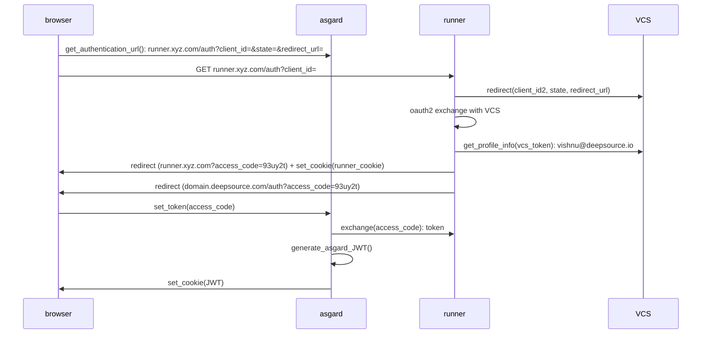

```mermaid
sequenceDiagram
browser->>asgard: get_authentication_url(): runner.xyz.com/auth?client_id=&state=&redirect_url=
browser->>runner: GET runner.xyz.com/auth?client_id=
runner->>VCS: redirect(client_id2, state, redirect_url)
runner->>runner: oauth2 exchange with VCS
runner->>VCS: get_profile_info(vcs_token): vishnu@deepsource.io
runner->>browser: redirect (runner.xyz.com?access_code=93uy2t) + set_cookie(runner_cookie)
runner->>browser: redirect (domain.deepsource.com/auth?access_code=93uy2t)
browser->>asgard: set_token(access_code)
asgard->>runner: exchange(access_code): token
asgard->>asgard: generate_asgard_JWT()
asgard->>browser: set_cookie(JWT)

```